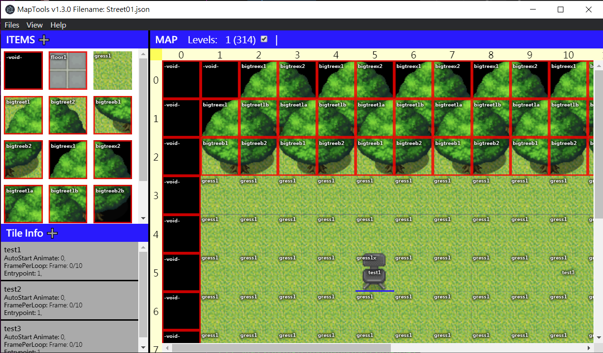

# RPG Maptools
Maptools for create RPG map in JSON format

# Setup 
Change the ASSETS_PATH to the rpg assets to load the tile images

# Npm Commands
- prodbuild - webpack build for production
- devbuild  - webpack build for development
- devwatch  - webpack build for development with change watch
- start     - start tthe electron
- build     - build dist

# Quick start
1. npm install
2. npm run devbuild
3. npm start